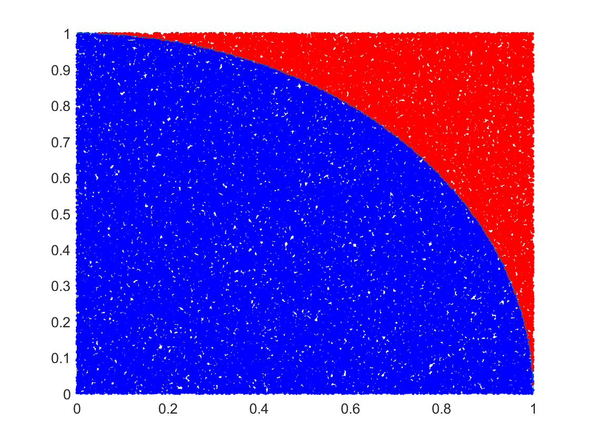

# Approximation of Pi using the Monte Carlo method

For n=100,000 randomly placed points.

How the approximation improves with increasing n:

| N         | Approximation |
|   :----:  |   :----:      |
| 1         | 0             |
| 10	      | 2.8000        |
| 100	      | 3.2800        |
| 1000	    | 3.1360        |
| 10000     |	3.1576        |
| 100000	  | 3.1366        |

Directly inspired by this visualization on Wikipedia:

I wrote this in MATLAB on a flight from Atlanta to St. Louis, where my alma mater Wash U is.

## Contact
jacoblee628@gmail.com
