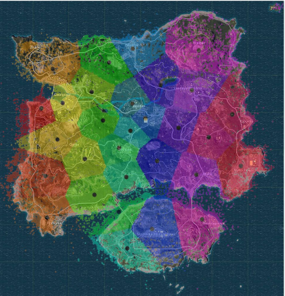
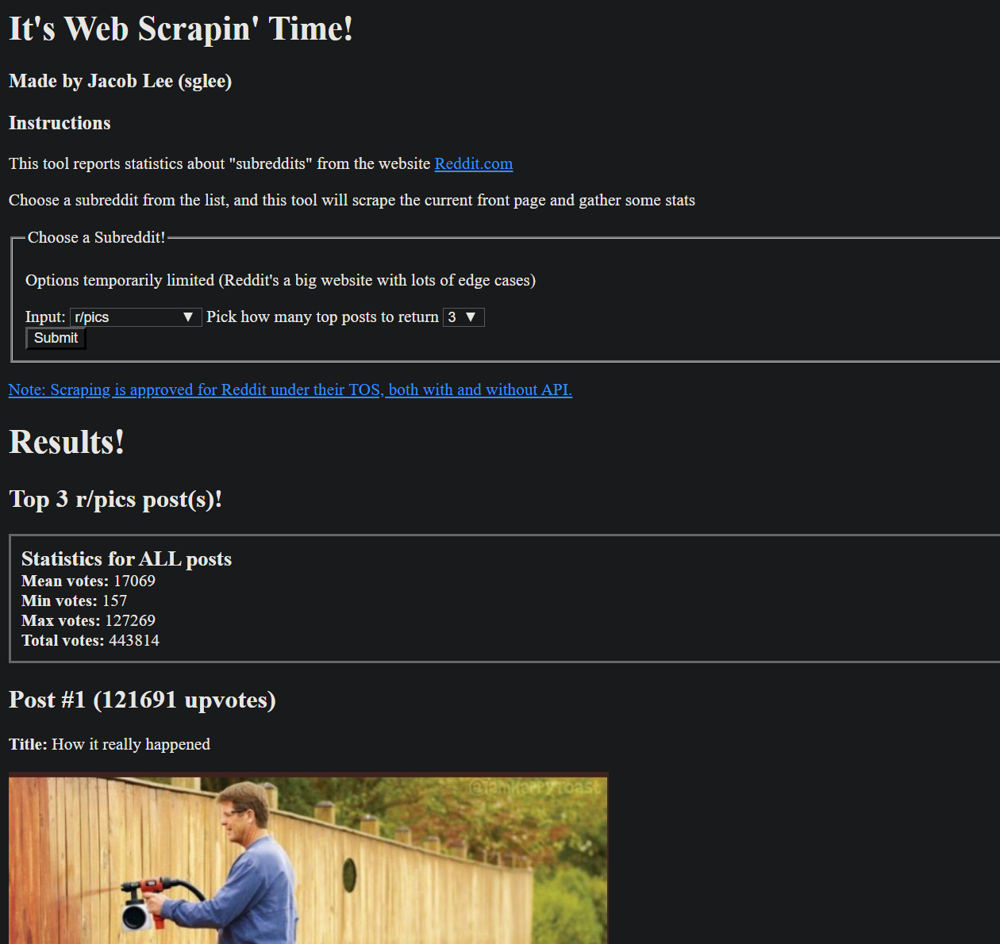
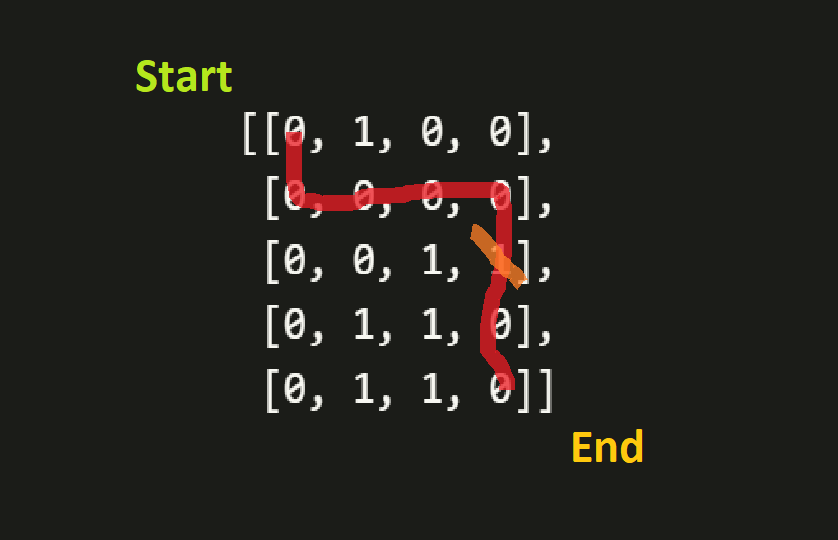

# Portfolio

My name's **Jacob Lee**. I am a current Master's candidate at Carnegie Mellon University, graduating in Dec 2020.

Incoming Data Mining intern at Bosch for summer 2020

## Contact
Email: sglee@andrew.cmu.edu  
LinkedIn: https://www.linkedin.com/in/jacoblee628/

## Project List

<b>[Click here for implementations of ML algorithms from scratch](machine_learning/implementations).</b>

1. **[Machine Learning Projects](machine_learning)**
   * [k-Means Clustering on PUBG Deaths (Spark, AWS)](machine_learning/kmeans_pubg)
   * [Sentiment Analysis on Car Review Text (R)](machine_learning/r_sentiment_analysis)
2. **[Data Visualization Projects](data_visualization)**
   * [Wikipedia Network Visualization & Webscraper (BeautifulSoup, NetworkX, Gephi)](data_visualization/wikipedia_crawler)
   * [Indeed Webscraper (BeautifulSoup, Jupyter Notebook)](data_visualization/indeed_webscraper)
   * [Subreddit Webscraper (Java Applet, TomEE)](data_visualization/webscraping_applet)
3. **[Mini Projects](mini_projects)**
   * [Automated Maze Solver - Google Challenge (Python)](mini_projects/google_challenge)
   * [Monte Carlo Pi Approximation (MATLAB)](mini_projects/monte_carlo_pi_approximation)

## Highlighted Projects

### [Wikipedia First Link Crawler](data_visualization/wikipedia_crawler)
  

Webscraping and visualizing the link-relationships between Wikipedia articles, essentially the [Wikipedia Philosophy phenomenon](https://en.wikipedia.org/wiki/Wikipedia:Getting_to_Philosophy).
Please see this [Medium Article](https://medium.com/@jacoblee628/all-roads-lead-to-philosophy-on-wikipedia-35d647b232b2) for a detailed writeup. 

-------

### [*k*-Means Clustering Visualization of PUBG Deaths](machine_learning/kmeans_pubg)
Visualized clusters of 9 million deaths in the video game *Player Unknown's Battlegrounds*.  
Final project for my undergrad Cloud Computing for Machine Learning course. Ranked #3 of 50 projects in the course.

-------

### [Subreddit Webscraper Applet](data_visualization/webscraping_applet)
A website that scrapes a subreddit from [Reddit.com](https://reddit.com) and gathers some stats and top posts.

-------

### [Google Coding Challenge (Maze Solver)](mini_projects/google_challenge)
My solution to a question I received in the [Google Foo Bar Challenge](https://www.geeksforgeeks.org/google-foo-bar-challenge/)

