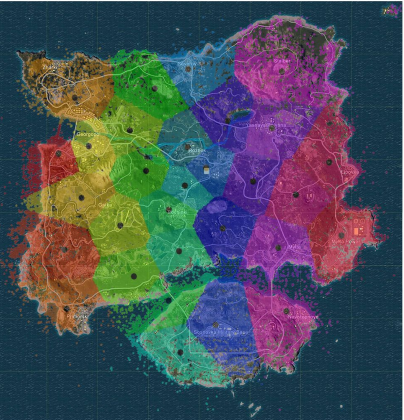
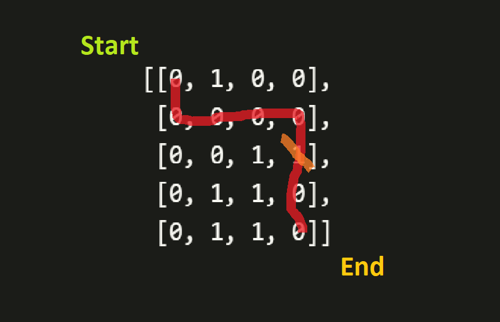

# Portfolio

My name's **Jacob Lee**. I am a current Master's candidate at Carnegie Mellon University, graduating in Dec 2020.

Looking for Summer 2020 internship opportunities, particularly as a machine learning engineer or data scientist.

## Contact
Email: sglee@andrew.cmu.edu  
LinkedIn: https://www.linkedin.com/in/jacoblee628/

## Highlighted Projects

### Wikipedia First Link Crawler
  

My implementation and illustration of the [Wikipedia Philosophy phenomenon](https://en.wikipedia.org/wiki/Wikipedia:Getting_to_Philosophy).  
Please see this [Medium Article](https://medium.com/@jacoblee628/all-roads-lead-to-philosophy-on-wikipedia-35d647b232b2) for a detailed writeup. 

-------

### *k*-Means Clustering Visualization of PUBG Deaths
Visualized clusters of 9 million deaths in the video game *Player Unknown's Battlegrounds*.  
Final project for my undergrad Cloud Computing for Machine Learning course. Ranked #3 of 50 projects in the course.

-------

### Google Coding Challenge (Maze Solver)
My solution to a question I received in the [Google Foo Bar Challenge](https://www.geeksforgeeks.org/google-foo-bar-challenge/)

-------

### Top N Netflix Movies
Returns the top N movies from [Netflix](https://www.kaggle.com/netflix-inc/netflix-prize-data/data) based on the sum of movie review scores.

This is a proof of concept on a large dataset. This can more easily be done in Spark; we did this mostly to practice implementing MapReduce on a lower level, in Java :)