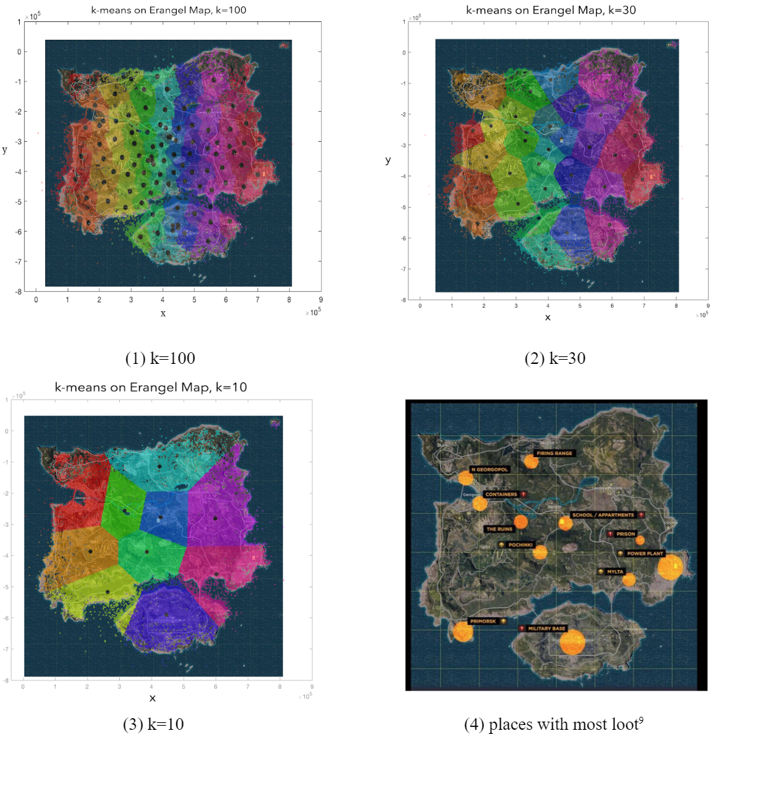

# Cloud Computing Final Project - k Means Clustering
For this term project, our team analyzed the relationship between player position and probability of death in the video game *Player Unknown's Battlegrounds*.

## Folder Contents
* *pubg_data.py* and *preprocess_pubg.py* are for transforming and ingesting the raw dataset.
* *kmeans_pubg.py* is for running the actual k-means algorithm
* *fx_pubg.py* contains various functions needed for the k-means algorithm.
* *visualizer.m* is a MATLAB script used for developing the visualization

## Methodology
We first transformed and loaded [this dataset from Kaggle.com](https://www.kaggle.com/skihikingkevin/pubg-match-deaths) onto Amazon Web Services (AWS) servers. The raw dataset has 13.4 million rows and 17 columns. We took a random subset of 9.8 million rows (to meet AWS storage limits), then manipulated and ingested the data using Pandas.

We then implemented and ran the k-means clustering algorithm in Spark. We were pleased to find the map could be divided into several different regions. We then visualized the data using MATLAB.

## Findings
We found that our clusters seemed to accurately capture loot hotspots, based on official game data. PUBG has every player starting off with no gear and scavenging for loot. As players will likely converge on areas with more loot, this insight seems to make sense.

