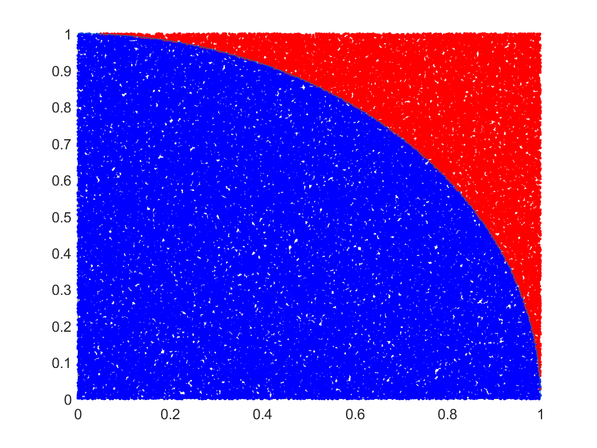

# Mini Projects

Here are a few smaller projects I've worked on.

## Contact
Email: sglee@andrew.cmu.edu  
LinkedIn: https://www.linkedin.com/in/jacoblee628/

## Highlighted Projects

### Monte Carlo Pi Approximation
A visualization of the [Monte Carlo method](https://en.wikipedia.org/wiki/Monte_Carlo_method); a process used to approximate areas/volumes.

-------