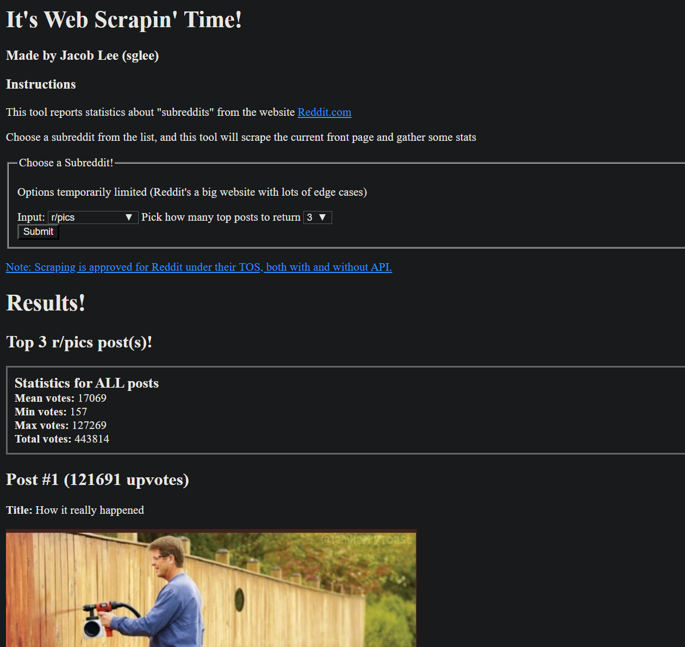

# Subreddit Webscraping Applet

This applet runs a website that scrapes parts of [reddit.com](https://reddit.com), a news aggregator site.

It can be deployed as a website anywhere. I ran it with [TomEE](https://tomee.apache.org/).

This was a project for a course at Carnegie Mellon.

## Screenshots

## Contact
Email: sglee@andrew.cmu.edu  
LinkedIn: https://www.linkedin.com/in/jacoblee628/