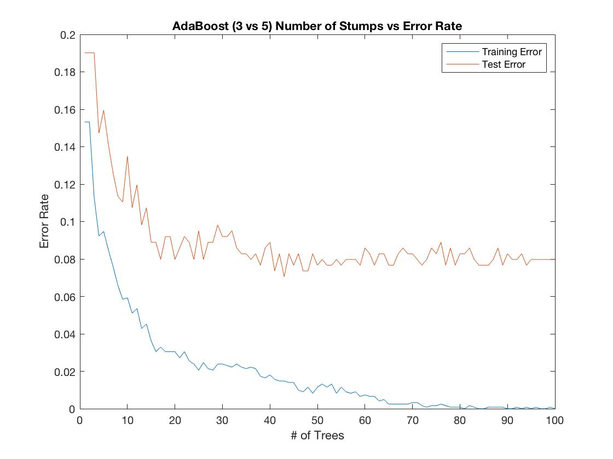

# ML Algorithm Implementations

These are a few algorithms I've implemented from scratch for my coursework.

## Projects

1. [AdaBoost on Decision Trees]((https://en.wikipedia.org/wiki/AdaBoost))
    - Implemented AdaBoost from scratch and illustrated its statistical properties.  
2. [Logistic Regression (via Gradient Descent)](https://en.wikipedia.org/wiki/Logistic_regression)
   - An implementation of logistic regression from scratch.
3. [Perceptron Learning Algorithm](https://en.wikipedia.org/wiki/Perceptron)
   - Linearly separates data in finite time.

## Contact
Email: sglee@andrew.cmu.edu  
LinkedIn: https://www.linkedin.com/in/jacoblee628/